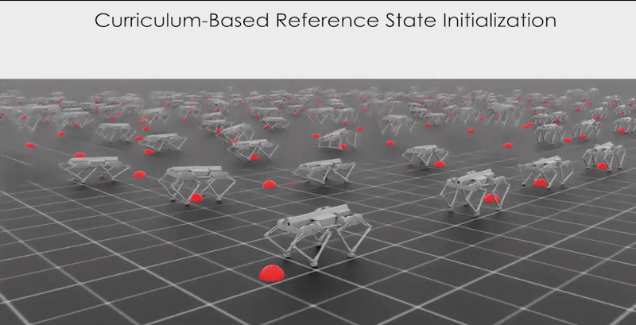
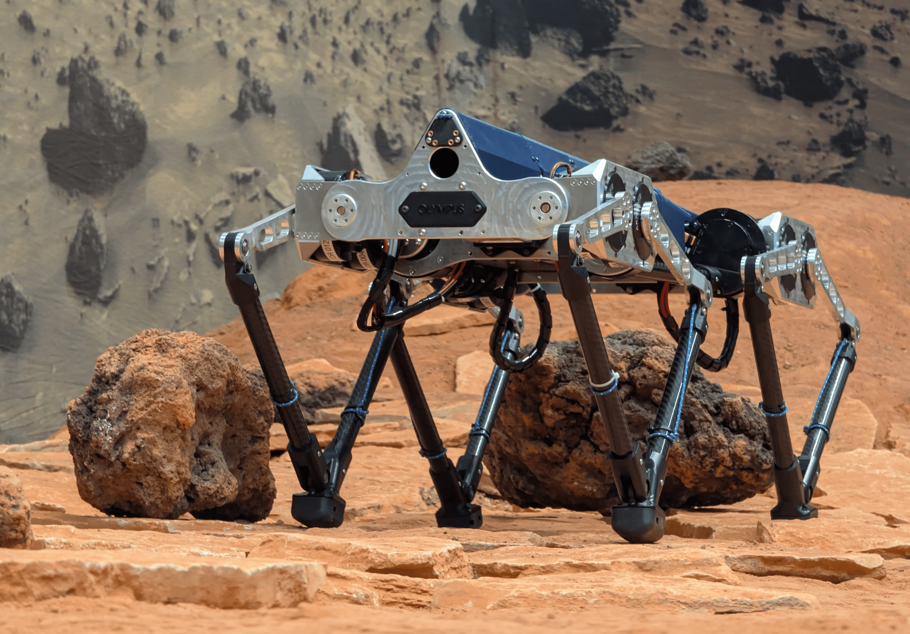
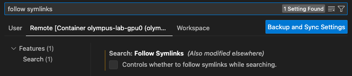

# Olympus-Lab: RL Environments for Olympus Quadruped

Reinforcement learning training environments for the OLYMPUS quadruped robot using Isaac Lab (4.5).

**Available Tasks:** Walking, Horizontal Jumping, Vertical Jumping, Attitude Control


<table>
  <tr>
    <th width="50%">Simulation</th>
    <th width="50%">Hardware</th>
  </tr>
  <tr>
    <td></td>
    <td></td>
  </tr>
</table>


Video showing Top left: down from height, top right: jump onto uneven landing, botom left: waling outdors with VIO for state estimate, bottom right: vertical jump

## Key features

- Multiple quadruped locomotion tasks for Earth gravity
  - Walking, horizontal jumping, vetical jumping
- Multiple quadruped locomotion tasks for Mars gravity (coming soon)
  - Walking, horizontal jumping, vetical jumping
- In-flight attitude control task
- Earth based policies tested on the Olympus uadruped
- Atitude control policy demonstraded at ESA's Orbitz facitlity at the Orbital Robotics Lab at ESTEC Netherlands
- Dockerized environment with multi-GPU support
- PPO-based policy learning (RL Games)


## Installation Guide (Recommended: Docker)

This guide will help you set up **Olympus-Lab** using Docker to run reinforcement learning environments for Olympus in Isaac Lab.

### Step 1: Clone the Repository
   ``` 
   git clone --recurse-submodules git@github.com:ntnu-arl/Olympus-Lab.git
   cd Olympus-Lab
  ```    

### Step 2: Generate docker-compose.yaml ###

To facilitate using this repo on shared GPU systems, the Docker containers are bound to one user and one GPU, i.e the containers are named 
olympus-lab-\<user\>-gpu-\<i\> and images olympus-lab-gpu-\<i\>. \ 

To generate the docker-compose.yaml corresponding to the number of GPUs on your system:  
  ```
    chmod +x docker/docker_setup.sh
    ./docker/docker_setup.sh
  ```

When working interactively with a Docker container, it is easy to get permission conflicts between the host and the container. 

To **build** the container run: 
```
python docker/container.py start --gpu <i>
```

This will prompt you whether to enable x11 forwarding or not.
Note that if you are on a remote workstation you have to setup an X-server for X11 forwarding to work.

To **enter** the container, either:
```
python docker/container.py enter --gpu <i>
```
or
```
docker exec -it olympus-lab-{$USER} bash
```
    
To stop the container run:
```
python docker/container.py stop --gpu <i>
```
or
```
docker stop olympus-lab-{$USER} 
```


**Note** that Isaac-Sim does not support multiple users streaming at the same time from the same IP. 
To commit this you can make your own docker network with an unique IP.
For users of ITK:10.53.10.99 this is obtained by passing --network simnet when creating the container.
      
**Note** 
If you want to be able to use multiple GPUs, this functionality is more than welcome, make a PR.


## Usage

### Train

To train a policy run:

```
python train.py --headless --task <task> 
```

### Play
To visualize the trained policy do:

#### Streaming

```
python play.py --task <task> --headless --livestream 1/2 
```
#### X11 forwarding

```
python play.py --task <task> 
```

#### Record video

```
python play.py --task <task name> --video --video_length <video length>
```

Note that for the Horizntal jump and Vertial jump use the task name "Olympus-Jump-Play "and "Olympus-Vertidal-Jump-Play" to always initialise in standig and with randomly sammpled jump height form all corriculim stages.

### Limit GPU memory usage
If you run out of GPU memory, this is likely because the JAX code for the inverse kinematics pre-alllocates 75% of the VRAM. To limit this, pass the following env variable when launching the train/play:

```
XLA_PYTHON_CLIENT_MEM_FRACTION=.XX python train/play.py < >
```
To get a consistent configuration, you can edit `docker/.env.user`. 

The tasks are split into three vategories, 1. Earth graviy, 2. Mars gravity (coming soon), 3. Zero gravity.
The full list of tasks supported out of the box are:
- Earth gravity
  - ```Olympus-Walk``` - ```Olympus-Jump``` - ```Olympus-Vertical-Jump```
- Mars gravity (coming soon)
  - ```Olympus-Walk-Mars``` - ```Olympus-Jump-Mars``` - ```Olympus-Vertical-Jump-Mars```
- Zero gravity
  - ```Olympus-Attitude-Control```


### Tensorboard
For tensorboard logging:

```
tensorboard --logdir logs/rl_games/<task-name> --host 0.0.0.0
```
    
## Development

We recommend opening the Docker container in VS Code using the appropriate extension. To correctly configure the Python language server do:

```
python .vscode/tools/setup_vscode.py
```

If you experience that the pylance is slow, make sure that you have disabled the following extension in VS Code:

  

## Citing
When using Olympus-Lab in your research, please cite:
```bibtex
@article{olsen2025towards,
  title={Towards Quadrupedal Jumping and Walking for Dynamic Locomotion using Reinforcement Learning},
  author={Olsen, J{\o}rgen Anker and Pettersen, Lars R{\o}nhaug and Alexis, Kostas},
  journal={arXiv preprint arXiv:2510.24584},
  year={2025}
}

```

```bibtex
@INPROCEEDINGS{olsen2025olympus,
  author={Olsen, Jørgen Anker and Malczyk, Grzegorz and Alexis, Kostas},
  booktitle={2025 IEEE International Conference on Robotics and Automation (ICRA)}, 
  title={Olympus: A Jumping Quadruped for Planetary Exploration Utilizing Reinforcement Learning for In-Flight Attitude Control}, 
  year={2025},
  volume={},
  number={},
  pages={4366-4372},
  keywords={Legged locomotion;Mars;Attitude control;Moon;Reinforcement learning;Quadrupedal robots;Gravity},
  doi={10.1109/ICRA55743.2025.11127737}}
```


## Contact
Jørgen Anker Olsen &nbsp;&nbsp;&nbsp; [Email](mailto:jorgen.a.olsen@gmail.com) &nbsp; [GitHub](https://github.com/jorgenao) &nbsp; [LinkedIn](https://www.linkedin.com/in/mihir-kulkarni-6070b6135/) 

Lars Rønhaug Pettersen &nbsp;&nbsp;&nbsp; [Email](mailto:lars.r.pettersen@hotmail.com) &nbsp; [GitHb](https://github.com/larsrpe) &nbsp; [LinkedIn](https://www.linkedin.com/in/lars-r%C3%B8nhaug-pettersen-517ba9250/)

Kostas Alexis &nbsp;&nbsp;&nbsp;&nbsp; [Email](mailto:konstantinos.alexis@ntnu.no) &nbsp;  [GitHub](https://github.com/kostas-alexis) &nbsp; 
 [LinkedIn](https://www.linkedin.com/in/kostas-alexis-67713918/) &nbsp; [X (formerly Twitter)](https://twitter.com/arlteam)


## Acknowledgements
This repository builds upon [Isaac Lab](https://github.com/isaac-sim/IsaacLab)](https://github.com/isaac-sim/IsaacLab)

## License
This project is licensed under the MIT License - see the [LICENSE](LICENSE) file for details.
  
